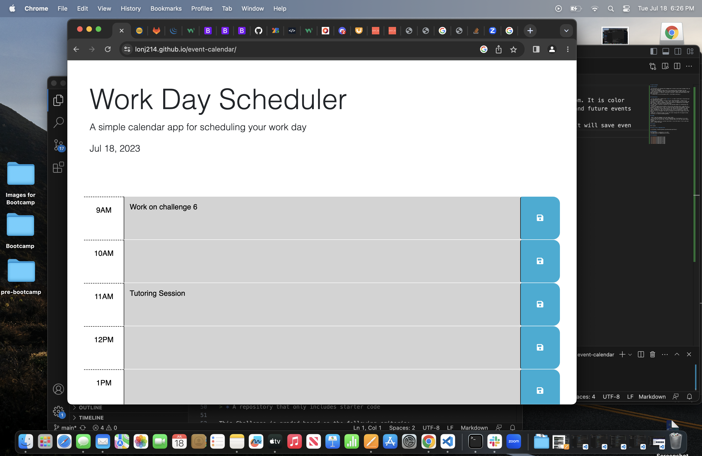
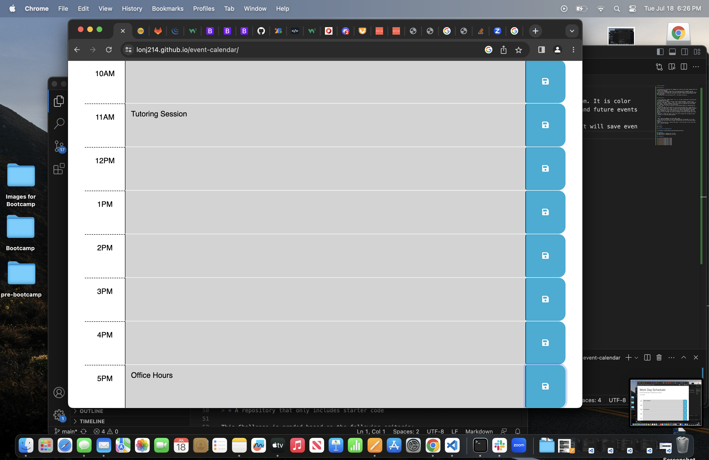
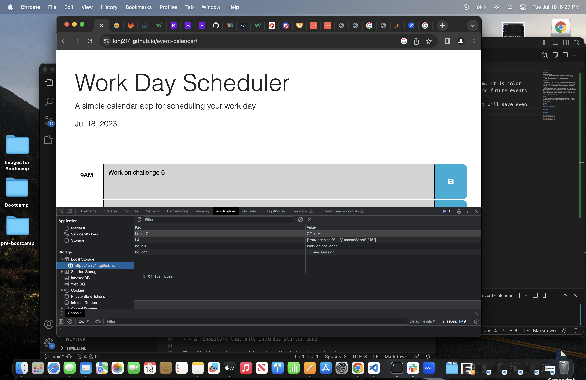

# event-calendar

## Description

- My motivation for building this webpage was to have an work event calendar that can help me stay organized.
- I built this webpage to keep track of my upcoming events throughout the day.
- This gives me a calendar that I can easily see what events I have coming up, what I need to be doing in a specific time block, and what I should have been doing in the past time block.
- I learned how to use third-party API's, like JQuery and day.js.

## Installation

- In the index.html I added 6 move "<divs>'s", so that I would have a time block per hour between 9am and 5pm.
- In the JS file I created a function called 'determineTimeNow'. Inside of the function I used JQuery 'this', '.attr', and '.slice' to plug in my id to target the time blocks. I used if statements within the function to generate the color-coded past, present, and future for the time blocks.
- I used '.each' function to execute for each matched element for determining the current time.
- In order to make the save button on the correct time block work, I used the id '.saveBtn' followed by the '.click' to create an event listener using JQuery. Followed by a function. The function takes the id of the siblings and the parent by using 'this' and adding a '.val' to the sibling, and '.attr' to the parent. I used the method 'setItem' that takes the correct id and the words entered by the user, and sets this to local storage. The event now displays in the local storgae, and on the browser.
- Ater this I wanted the event to save into local storage after the page has been refreshed, so I used the method getItem. 

## Usage

- When I open the webpage I can view today's date.
- I can see the time block for each corresponding hour from 9am-5pm. It is color coded so that the current hour is green, the past hours are red, and future events are grey.
- When I add an event to a certain time block, I can click save. It will save even after I refresh the page.

## License

MIT license

## Direct Link to Deployed Site

[link](https://lonj214.github.io/event-calendar/)

## Deployment
The application is deployed at live URL
The application is loading with no errors

## Screenshots

